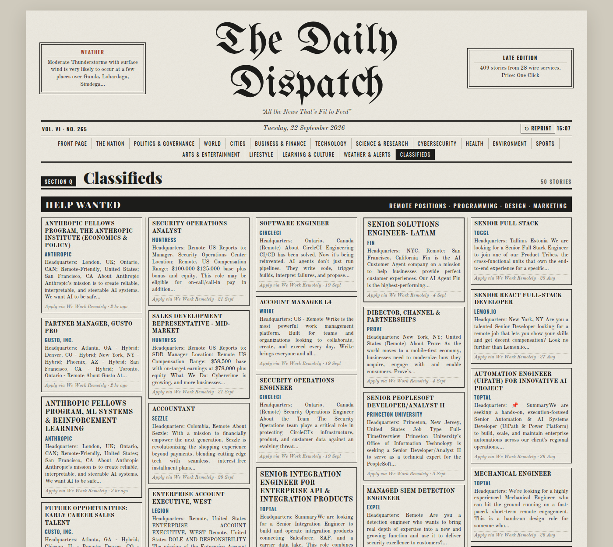

# The Daily Dispatch

A vintage broadsheet-style newspaper, in a colour e-ink look, built from the RSS/Atom feeds listed in an OPML file.



## Quick start

You need **Node.js 18 or newer** ([download](https://nodejs.org)). There are no packages to install.

```bash
git clone https://github.com/rubix-coder/daily-dispatch.git
cd daily-dispatch
npm start
```

Then open **http://localhost:8080**.

### Or with Docker

```bash
docker compose up -d
```

Then open http://localhost:8080. `feeds.opml` is mounted into the container, so edits to it take effect without rebuilding.

## Using your own feeds

The paper reads **`feeds.opml`** in the project folder. To use your own feeds, replace that file with an OPML export from any feed reader (Feedly, Inoreader, Feedbro, NetNewsWire…). You can also point at a file somewhere else:

```bash
FEEDS_FILE=/path/to/my-feeds.opml npm start
```

Top-level folders in the OPML become sections (e.g. *Technology*, *Finance*, *Jobs*). General news feeds are split into Nation, World, Sports, Business, Health, Environment and so on, based on each article's URL and headline. The server reloads the file whenever it changes.

## Settings

| Variable     | Default      | Meaning                                                     |
|--------------|--------------|-------------------------------------------------------------|
| `PORT`       | `8080`       | Port to serve on                                            |
| `HOST`       | `0.0.0.0`    | `0.0.0.0` = reachable from your network; `127.0.0.1` = this machine only |
| `FEEDS_FILE` | `feeds.opml` | Path to the OPML file                                       |

## Hosting it on your own machine (Linux, systemd)

This keeps the paper running in the background, restarts it if it crashes, and starts it at boot.

```bash
mkdir -p ~/.config/systemd/user
cp deploy/daily-dispatch.service ~/.config/systemd/user/
# Edit WorkingDirectory in the copied file to point at where you cloned the project.
systemctl --user daemon-reload
systemctl --user enable --now daily-dispatch
loginctl enable-linger "$USER"     # start at boot, even before you log in
```

Everyday commands:

```bash
systemctl --user status daily-dispatch      # is it running?
systemctl --user restart daily-dispatch     # after pulling new code
journalctl --user -u daily-dispatch -f      # live logs
systemctl --user disable --now daily-dispatch   # stop and remove from startup
```

Other devices on your Wi-Fi can open `http://<this-machine's-IP>:8080`. To find the IP, run `hostname -I`.

**Reaching it from outside your home:** the simplest safe option is [Tailscale](https://tailscale.com) (private access from your own devices) or `cloudflared tunnel` (a public URL). Both avoid opening ports on your router. The app has no login, so anyone with the URL can read your paper.

## How it works

- `server.js`: serves `public/` and fetches feeds for the browser, which can't fetch most feeds directly because of CORS. It only fetches feeds listed in the OPML file, never arbitrary URLs. Feeds are cached for 10 minutes. **↻ Reprint** fetches fresh copies.
- `public/app.js`: parses RSS/Atom, removes duplicate stories, sorts them into sections and lays out the pages. To add or rename sections, edit `SECTIONS` and `classify()`.
- `public/styles.css`: the newspaper design (6-column grid, column rules, drop caps, halftone photos).

Keys: ← / → turn pages, Esc closes an article.

## License

[MIT](LICENSE)
